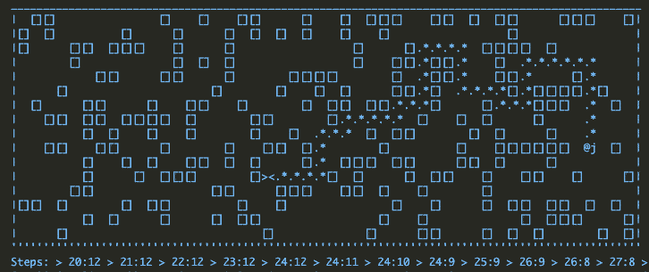

# Pathfinder

An example of pathfinding on the grid-based map. Just run in the terminal:

```shell
$ lua main.lua
```

## Modules

`generator` generates the map with walls and floors and random free points.

`pathfinder` looks for the best way to pass from the start point to the target point by A-star algoritm.

`display` prints the whole map and the path with full steps list.

## Example of output

